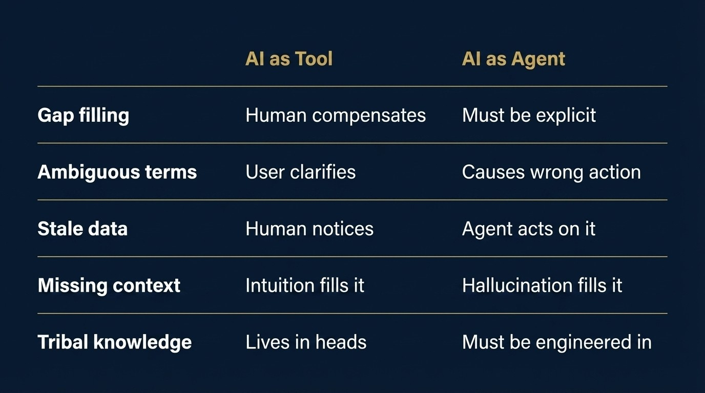

*Humans compensate for bad data. Agents can't.*

## The Uncomfortable Number

A March 2026 study by Harvard Business Review Analytic Services and Cloudera surveyed 230+ enterprise data leaders with a simple question: is your data ready for AI?

**Only 7% said yes.**

Only 7%. Completely ready. The other 93% are not — and are running AI experiments on a foundation that was never designed for what they're asking it to do.

This is the real bottleneck of 2026. Not the model. The data layer underneath it.

## Two Different Consumers. Two Different Requirements.

When humans use AI as a tool, they fill the gaps. They bring domain knowledge, read between the lines, catch the edge cases. They know that "revenue" in the finance table means recognized revenue, not bookings. They know the Q3 number in the dashboard is wrong because of the migration in August.

Agents don't know any of that. They can't ask. They act.

The moment you move from AI-as-tool to AI-as-agent, the bar for data readiness doesn't go up incrementally. It transforms categorically.

## The Accuracy Cliff Is Real

Here's the data that stopped me.

GPT-4o tested on a clean academic benchmark — 10 to 20 tables — achieves 86% accuracy.

Put the same model on an enterprise database with 1,000+ columns? Accuracy drops to 6%.

That's not a model failure. That's a context failure.

The fix isn't a smarter model. Research on dbt Labs' semantic layer shows that adding a knowledge graph to raw SQL moves accuracy from 16.7% to 54.2% — more than 3x improvement, with no model change. The progression looks like this:

| Layer | Accuracy |
|---|---|
| Raw schema only | 10–20% |
| + Relationship mapping | 20–40% |
| + Data catalog | 40–70% |
| + Semantic layer | 70–90% |
| + Tribal knowledge | 90–99% |

Each layer is not a nice-to-have. It is load-bearing infrastructure.

## Three Things That Have to Change

**1. Meaning must become machine-readable.**

What does "customer" mean in your system? What counts as "active"? Humans know because someone told them once. Agents need a semantic layer that makes business definitions explicit, consistent, and queryable. Snowflake, Databricks, and Google all moved here in the last six months — not because it's trendy, but because agents break without it.

**2. Tribal knowledge must be engineered, not assumed.**

The most important context in any enterprise isn't in a database. It's in someone's head. The exception rule no one documented. The metric that's technically wrong but everyone uses. Before deploying agents, someone has to do the hard unglamorous work of making implicit knowledge explicit. As Andreessen Horowitz describes it, this "human refinement" step — capturing tribal knowledge that automated context construction cannot reach — is what most organizations skip because it doesn't feel like engineering. It is.

**3. Pipelines must move from batch to event.**

Most enterprise data was designed for humans to query when ready. Agents need to react as things happen. That means rebuilding pipelines for event-driven architecture — an investment that rarely appears in the original AI project scope, and almost always surfaces as a surprise in production.

## The Shift in One Line

> Data was built for humans to query. Agents need data built to act on.

That's not a prompt engineering problem. Not a model selection problem. It's an architectural decision that has to be made before the agent is deployed — not after it fails.

The organizations pulling ahead in 2026 aren't the ones with the best models. They're the ones who did the unglamorous work of building a data layer that agents can actually trust.

That work starts with a question most teams haven't asked yet:

*If we removed every human from this workflow — would the data still make sense?*

---

**Sources:**

1. HBR Analytic Services + Cloudera — *Taming the Complexity of AI Data Readiness*, March 2026.
2. Andreessen Horowitz — *Your Data Agents Need Context*, March 2026.
3. Promethium.ai — *Conversational Analytics: How AI Agents Are Transforming Enterprise Data Access in 2026*, February 2026.
4. Dreamix — *Data Readiness for AI: 3 Barriers Companies Still Overlook*, April 2026.
