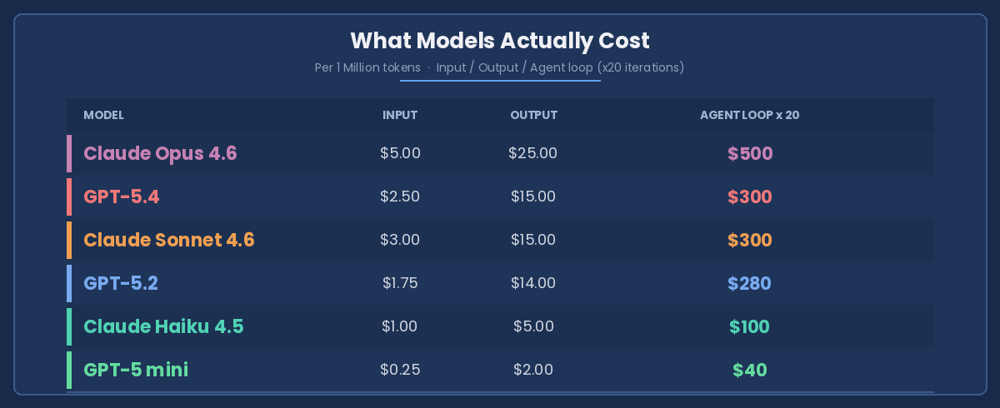
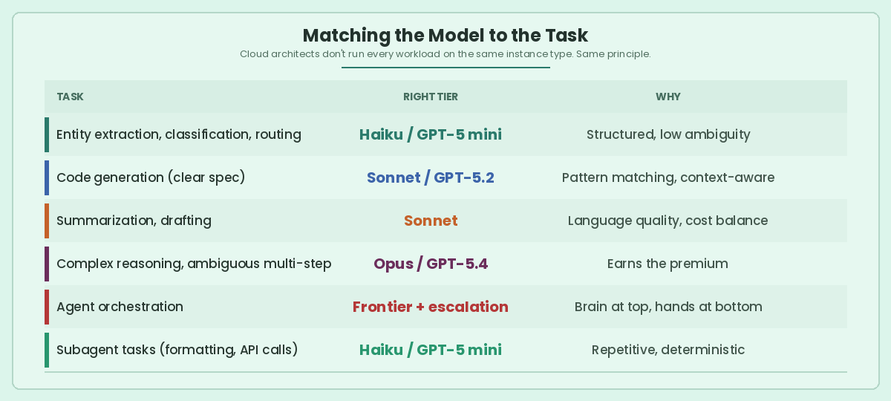

Here's a pattern I keep seeing in teams building with LLMs.

An engineering team adopts AI. They pick a frontier model — Opus, GPT-5.4, whatever's top of the leaderboard. It works. They ship. Every task runs through it. JSON extraction. Summarization. Classification. Multi-step reasoning. All of it.

The problem wasn't a wrong choice. It was no choice at all.

If you've been in cloud long enough, you recognize this. It's 2012 again. Running an m5.16xlarge for a cron job. The bill arrives. You feel it.

We built entire disciplines to fix that — FinOps, auto-scaling, reserved capacity, right-sizing. We learned that cost wasn't a finance problem. It was an architecture problem.

The AI industry is relearning the same lesson with a different currency. Tokens.

## What Models Actually Cost

That last column is the one nobody looks at.

In agentic systems, prompts don't fire once. They fire in cycles — reflection steps, tool calls, retries, self-correction. A single model choice doesn't add cost. It compounds it.

Opus running 20 agent iterations: $500. GPT-5 mini doing the same loop: $40. That's a 12x difference. Even mid-tier models like Sonnet and GPT-5.2 at $300 per loop are 7x what GPT-5 mini costs — for tasks where the lighter model handles the job just fine.

And cost isn't the only thing compounding. Latency does too. Frontier models are slower. In real-time pipelines, that slowness cascades through every downstream step.

## The Model Hierarchy

Not every task earns your smartest model. Think of it as a pyramid.

**Tier 1 — Frontier (Opus 4.6, GPT-5.4)**
Complex reasoning, ambiguous problems, final synthesis. Use intentionally, not by default.

**Tier 2 — Mid-Tier (Sonnet 4.6, GPT-5.2)**
Most production workloads. Code generation, structured analysis, drafting. This is your default.

**Tier 3 — Worker (Haiku 4.5, GPT-5 mini)**
High-volume, deterministic tasks. Classification, extraction, routing, subagent I/O. Scale here.

**Below the pyramid — Plain Code**
Anything deterministic, rules-based, or latency-critical. Date parsing. Regex. Validation. Don't pay a model to do what a function does in microseconds for free.

The rule: start at the bottom. Escalate only when the task demands it.

## Matching the Model to the Task

*Cloud architects don't run every workload on the same instance type. Same principle applies here.*

## How to Architect for This

Patterns that separate cost-aware AI systems from expensive ones:

**Route first, call second.** Classify the task, then pick the model. A cheap classifier or simple heuristic can decide which tier handles the work.

**Mix models in your agents.** The orchestrator thinks on Tier 1. The subagents doing tool calls and formatting run on Tier 2 or 3. One agent, multiple models.

**Build escalation in.** Start cheap. If the model fails or confidence is low, route up to a smarter one. Without this, every task defaults to the expensive path.

**Manage your context window.** Every token in the prompt is money spent. Trim conversation history. Summarize long documents before passing them in. The difference between sending 50K tokens and 5K tokens is a 10x cost difference — before the model even starts thinking.

**Cache what repeats.** System prompts, shared context, common instructions — cache them. Prompt caching cuts input costs by up to 90%.

**Skip the model entirely.** Code is still King. If a task has a deterministic answer, write the function. Regex, validation, date parsing — these don't need intelligence. They need code.

## Cost Is a Design Decision

Token pricing is dropping. Models are getting efficient. The economics will get easier.

But the teams building cost-aware architectures today won't be scrambling to retrofit them tomorrow. The best AI engineers already treat model selection the way cloud engineers treat instance selection — as a design decision, not a billing surprise.

Right-sizing compute took a decade. We called it cloud maturity.

Right-sizing intelligence is the same discipline. New currency. Same principle.
